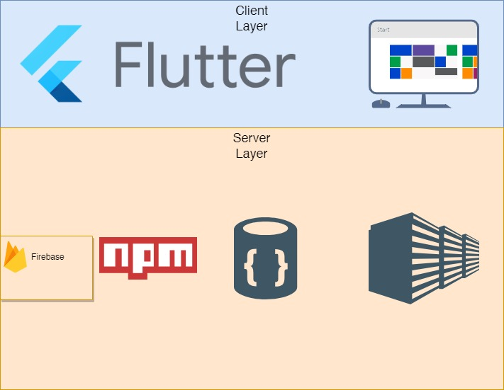

# EPI-Use-technical-challenge
This is my attempt at the EPI-USE technical evaluation challenge for the Technical Internship

  The challenge is to create a cloud hosted employee management system for Epi-Use Africa where the user can create, delete, read, update and delete (Perform CRUD operations on) employees. The system also allows users to control the management structure by providing a field to allow users to assign managers to employees.

## The "Team"
#### Mbofho Mamatsharaga

#### Role(s): Frontend Engineer

#### 3rd Year Computer Science Student at The University Of Pretoria

#### Favourite Language(s): Dart, Java, Javascript

 

## Tech "Stack"

    There isn't too much complication with the tech stack as I had identified that it is quite a simple setup.

### Frontend: Flutter

  Flutter is a brilliant cross-platform front-end framework that isn't restricted by any operating system or platform. It works really well in this scenario as a future proofing mechanism if I may call it that. Should I want to port the web-app to a different platform, it will be very easy.

### Backend: FlutterFire

  I am using Flutterbase as the backend for my flutter front end as they work well together, especially given that they both are under the same parent company (Google). and minimal setup is required to get them to communicate. It also affords me the opportunity to learn something I am not familiar with, which is a NoSql database.

### Database: Firestore

  For the same reason I went with a FlutterFire setup, I went with Firestore NoSQL database, It works well with Flutter and is incorporated into Firebase already, It is also offering me the opportunity to challenge myself as I have never worked with a NoSQL database before. I must say, I do think this is the future.

## Git Strategy

  Given I was working alone, I didn't necessarily have a git strategy or different branches, this situation is possibly because there isn't a possibility of conflicts, and if a feature I am working on breaks my web-app locally, I can just hold off on committing until I've fixed my error.
  There is only one branch, which is main, that is where everything resides.

## Architecture

  For my system I used the client-server architecture, I only have 2 layers and they look as follows:

-   **Server Layer**: This is the backend and where our database resides. my entire backend is here, all done in Firebase for authentication and Firestore for database needs.

-   **Client Layer**: I used flutter for the client layer, which can also be seen as a presentation layer. I chose flutter because of it's cross-platform capabilities.

  **Below is a picture of My Architectural diagram:**
  
   

 

 ## How to Run

 ### Frontend

- If you do not have the Flutter SDK installed already, install it as follows, if you do have it installed, skip:
  - Download the latest stable version of the Flutter SDK on [The Flutter site](https://docs.flutter.dev/get-started/install)
  - Follow the instruction for installation on your operating system.
  - Test if installation was successful by running the command "flutter doctor" in your command prompt or powershell.
  - If all is successful, you can skip the next instruction.
  - If it is not successful, resolve (consult the Flutter site and GitHub Repo issues for possible resolutions).
- clone the main branch on my Repo.
- Open the project in any IDE of your choice, preferrably Visual Studio Code.
- change device to any browser of choice.
- Navigate to the 'main.dart' file.
- in the main.dart file, at the top right of the screen, click on the drop-down next to the play button.
- click on "start debugging".
- the app will be running on the emulator.
- Use login credentials as follows:
    -Staff Number: mbofho47@gmail.com
    -Password: LetAdminIn 

 ### Backend

 

  The backend is always running, there isn't a need for you to do anything in that regard.

## Other Documents

  Below is a set of documents I used in the implementation process. This includes my coding standards, technical installation Manual and SRS document.

      <a href="https://docs.google.com/document/d/1mSOIcdF3GbhQnzImzCB8trRuEELl3aPPclsIAYZY72Y/edit?usp=sharing">SRS Document</a>
      <a href="https://drive.google.com/drive/folders/1C48Rjn7Eo_8PuVKNkubxDfW8ZaCiqCG4?usp=sharing">Google Drive </a>
  
  